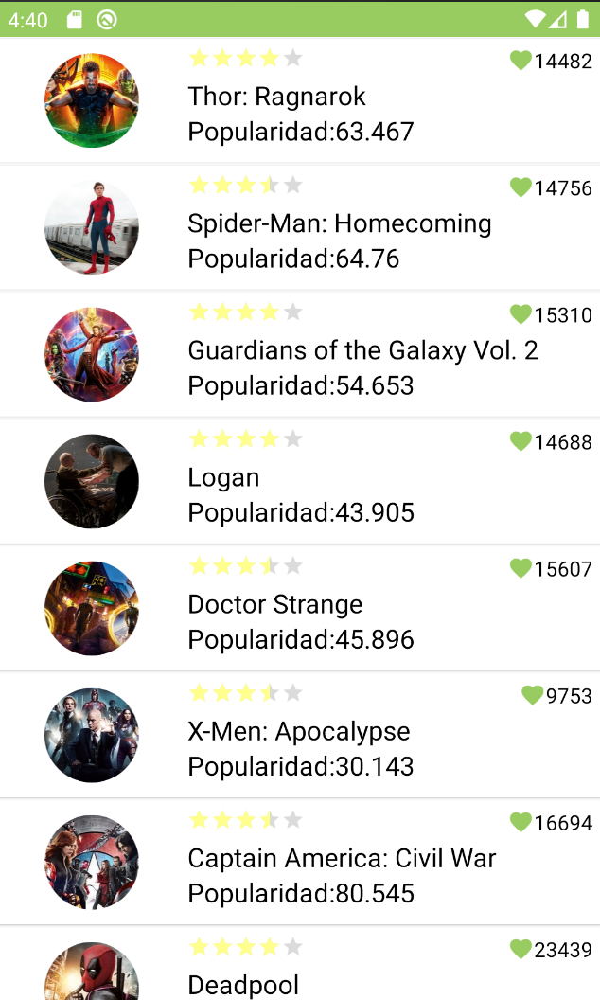
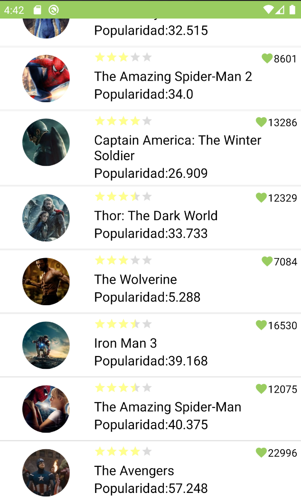
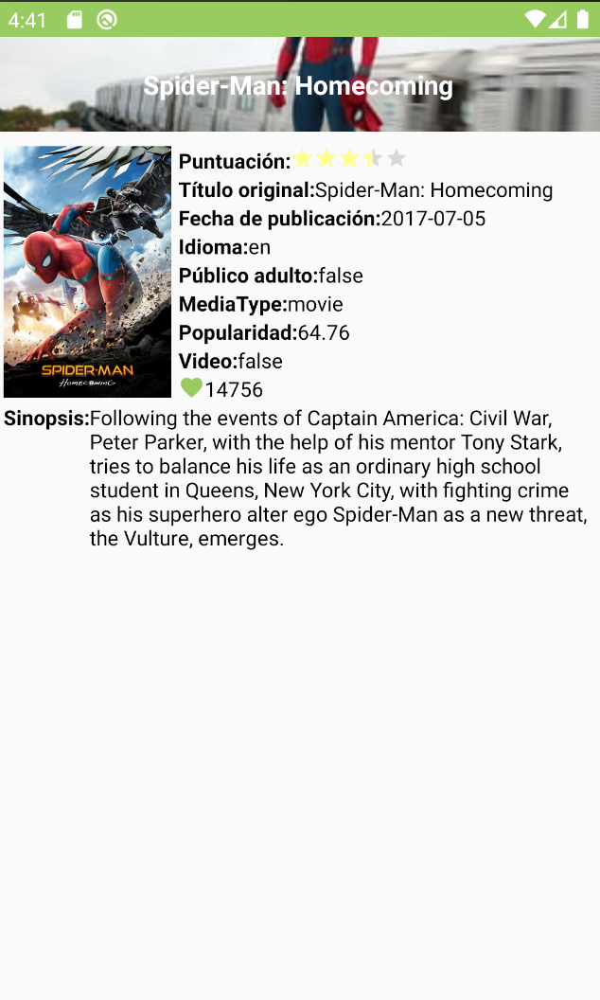

# MoviesSample

MoviesSample is a test app to list popular films from [themoviedb](https://www.themoviedb.org/).

_It has developed with Kotlin. Based on SOLID principles and Clean Architecture._

## Screenshots:

   

  

_This project was inspired by [Android-CleanArchitecture-Kotlin](https://github.com/android10/Android-CleanArchitecture-Kotlin) by [Fernando Cejas](https://fernandocejas.com/)_

**This product uses the TMDb API but is not endorsed or certified by TMDb**

[themoviedb.org terms of use](https://www.themoviedb.org/terms-of-use)

